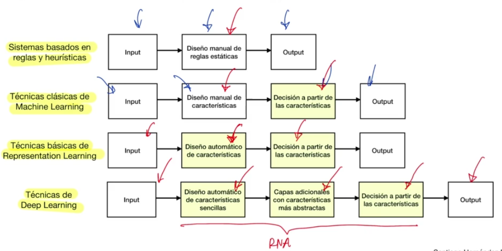

# Deep Learning
Es un subdominio del **Machine Learning** que resuelve el problema de las técnicas de **Representation Learning** introduciendo representaciones que se expresan en términos de otras representaciones más simples. Se fundamenta en la construcción de conceptos complejos a partir de conceptos más simples.

El **Deep Learning** involucra las técnicas de **Machine Learning**. Su funcionamiento es muy similar a las de **Machine Learning**. La diferencia entre ambas es que el **Conjunto de Datos de Entrenamiento** del gráfico de **Machine Learning** consistia en características de entrada seleccionadas de forma concienzuda que marcaba muchísima la predicción o la efectividad del algoritmo de **Machine Learning**.
En éste caso, en nuestro conjunto de datos de entrenamiento, vamos a tener información o datos en bruto que proporcionaremos a nuestro algoritmo de **Deep Learning** y ese algoritmo será el que se encargue de seleccionar las características que considere más oportunas para resolver este problema y de proporcionarnos el final el resultado.
Sin embargo, se seguirán teniendo parametros del **Modelo**, el algoritmo seguirá correspondiendo con una serie de funciones matemáticas que se irán ajustando durante el proceso de **Entrenamiento**.
Lo que cambia en esencia es que si antes se quería predecir si aparecía un objeto o no en una imágen y empezábamos a extraer características de ese objeto como la intensidad de los píxeles que representan una parte del objeto. Para el caso de **Deep Learning** ya no se hace nada de eso, sino que se proporcionará toda la imágen, todo nuestro algoritmo y será el algoritmoel que decidirá que es lo importante y que no. Para diferenciar entre imágenes en las que aparece el objeto e imágenes en las que no aparece.

Si usamos el ejemplo del auto

Cuando usabamos las **técnicas de Machine Learning** teníamos que tomar la imágen de un auto, realizar la extracción de características de alguna forma (ya sea identificando un foco, una rueda, la luneta, etc.), después proporcionábamos esas características a nuestro algoritmo de **Machine Learning** para que nos diga si aparecía o no un auto en esa imágen.
En cambio, con las téccnicas de **Deep Learning** tomamos la imágen, le indicamos si en esa imágen aprece un auto o no para ese proceso de entrenamiento, le proporcionamos esa imágen a nuestro algoritmo de **Deep Learning** que es el que se va a encargar de realizar todo el proceso hasta que nos devuelve una predicción indicando si en esa imágen aparece un choche o no.

El criterio de elección entre una técnica de **Machine LEarning** frente a la de **Deep Learning** depende de las necesidades y recursos. Las técnicas de **Deep Learning** van a estar orientadas más a problemas para los que realizar una primera extracción de características es algo complejo como la detección de imágenes, de texto, identificación de lo que se idce en un audio, etc.

## Descripcion
El **Deep Learning** se basa en **Redes Neuronales Profundas**.
Si obtenemos información o datos como en la imágen donde aparece una persona y se la proporcionamos a una **Red Neuronal** que tendrá diferentes capas y diferentes neuronas artificiales por cada una de las capas.

Una de las intuiciones que debemos tener es que éstas **Redes Neuronales**, en la imágen la primera capa es la *Visible layer (input pixels)*. La segunda capa es *1st hidden layer (edges)* y así sucesivamente hasta el final, donde la última capa es la de *Output Layer (object identity)* y es la que nos va a proporcionar la predicción.
Lo que van a ir haciendo éstas capas es, de alguna manera van a ir aprendiendo características, extrayendo características de esa imágen. Y a medida que va avanzando en las **Capas de la Red Neuronal** (*en el ejemplo avanza hasta arriba*), lo que va a pasar es que se van a ir componiendo características más complejas, las características más sencillas convergen en características más comlejas.
En el ejemplo, la primera capa de la red Neuronal se dedica a extraer algunas características que aparecen en la imágen como por ejemplo colores, el azul, el marrón, etc. 
La siguiente ya empieza como a identificar una serie de texturas, diferentes combinaciones de colores.
A medida que avanzamos a la siguiente capa van apareciendo cosas más interesantes, como si fuese un ojo, aparecen diferentes contornos, un vértice, etc.
Si seguimos avanzando, empiezan a aparecer partes del ser humano como una oreja o una cara.
Y finalmente, en la última capa ya es en la que se toma una decisión de si en ésta imágen aparece un auto, una persona o un animal.
Esta es una de las intuiciones que debemos tener (**osea que ésto es una Intuición**).

Hay que tener en cuenta que cada una de las capas lo que van a hacer es ir ajustando una serie de parámetros, de manera que cada neurona artificial de esa capa se va a encargar de identificar una característica que aparece en la imágen, o de una serie de características.
Y normalmente las primeras capas de la red, serán características más básicas, más sencillas, que irán convergiendo y construyendo características más complejas a medida que avanzamos en las capas de nuestra red neuronal.

## Diferencia global entre las diferentes técnicas de Machine Learning

- **Sistemas basados en reglas y heurísticas:** (es de los más clásicos) Lo que hacíamos en éste sistema era definir una serie de patrones, una serie de umbrales que si se cumplían entonces realizábamos o tomábamos una decisión u otra. Por ejemplo, para las transacciones fraudulentas yo definía que si una caracterísitca determinada superaba un número, entonces esa transacción podría ser fraudulenta, o si varias características superaban diferentes umbrales ya se podían considerar fraudulenta o legítima. El mismo criterio se usaba para el ejemplo del paciente.
En éste tipo de sistemas más tradicionales teníamos un *input*, realizabamos un diseño manual de esas *reglas estáticas* (esos umbrales que identificaban si pertenecía a una clase o a otra), aplicábamos esas reglas sobre el *input*, de manera que obteníamos finalmente la decisión o la clasificación que nos proporcionaba en base a esas reglas que habíamos definido.

- Cuando avanzamos un poco más y aparecen las **Técnicas clásicas de Machine Learning**: tenemos un *input*, nosotros diseñamos una serie de características manualmente, esas características que veíamos como por ejemplo sintomas o características de la transacción, etc. Y le proporcionamos esas características a un algoritmo que toma la decisión por su cuenta a partir de esas características y nos devuelve un *output* de acuerdo a una predicción.
Hasta éste paso todvía se sigue dependiendo del analista.

- Seguimos avanzando y ya para las **Técnicas básicas de Representation Learning** se añade un paso más en el "Diseño automático de características" porque ésta abstracción ya es automática y la realiza un algoritmo al cual le pasamos esa información. Extraemos esas características mediante un algoritmo, **no lo realiza un analista** y otro algoritmo toma la decisión a partir de esas características que se han extraído previamente.
En ésta instancia el analista ya se encuentra más desacoplado de todo el proceso general de predicción.
Sin embargo hay determinados problemas para los que las técnicas de extracción de características no funcionan adecuadamente, por ello surgen las técnicas del siguiente punto (deep learning y end-to-end learning).

- **Técnicas de Deep Learning**: Se obtiene un *input* que serán proporcionados a un algoritmo que va a realizar un diseño automático de características sencillas, las primeras **Capas de nuestra Red Neuronal**, después van a converger esas características para formar características más complejas, más abstractas y finalmente, ese mismo algoritmo tomará una decisión a prtir de esas características que nos devolverá el *output* o la predicción. Y todo éste proceso va a realizarlo un mismo algoritmo que en general será una **Red NEuronal Artificial**.

