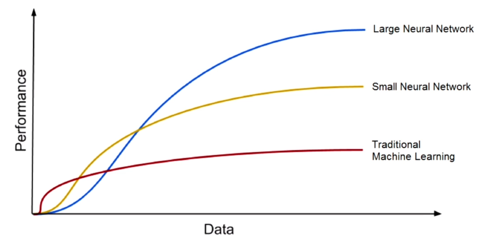
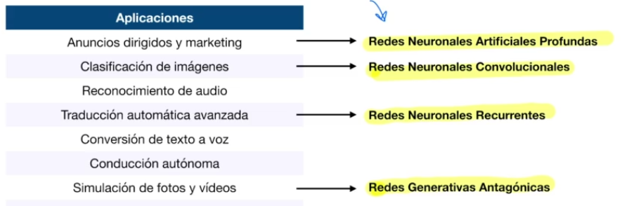

# Aplicaciones y Clasificación de las técnicas de Deep Learning

La relación de algoritmos de **Deep Learning** con los **Conjuntos de datos de entrenamiento** son claves, ya que para que los algoritmos de **Deep Learning** funcionen adecuadamente se requiere un conjunto de datos grande.
En el diagrama se puede ver el tamañp del **Conjunto de datos** que es más grande a medida que avanzamos hacia la derecha y en el eje vertical tenemos el rendimiento de nuestro algoritmo de **Machine Learning** o **Deep Learning**.
Lo que se ve es 'qué tan bien' hace las predicciones a medida que avanza hacia arriba. 
En la gráfica también se ve cómo las técnicas tradicionales de **Machine Learning** se comportan mejor con volúmenes de conjuntos de datos más pequeños al inicio de la curva, pero a la larga cuando se avanza en el tamaño del conjunto de datos de entrenamiento lo que pasa es que las **Redes Neuronales** profundas, las técnicas de **Deep Learning** van funcionando mucho mejor y van proporcionando un rendimiento más alto.
De hecho cuanto más grande sea el conjunto de datos para las **Redes Neuronales** o para **Deep Learning** funcionan mejor y terminan superando el redimiento de las **técnicas tradicionales de Machine Learning**.

## Redes Neuronales

Hay diferentes algoritmos y cada uno resuelve de forma más optima determinados problemas. En el siguiente cuadro se ve que redes son más óptimas para determinadas aplicaciónes.

