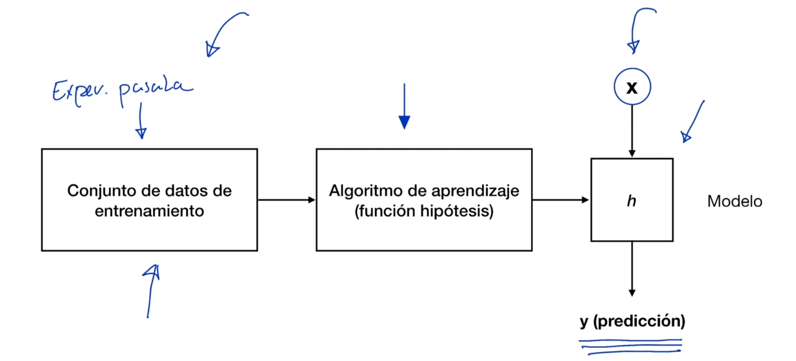
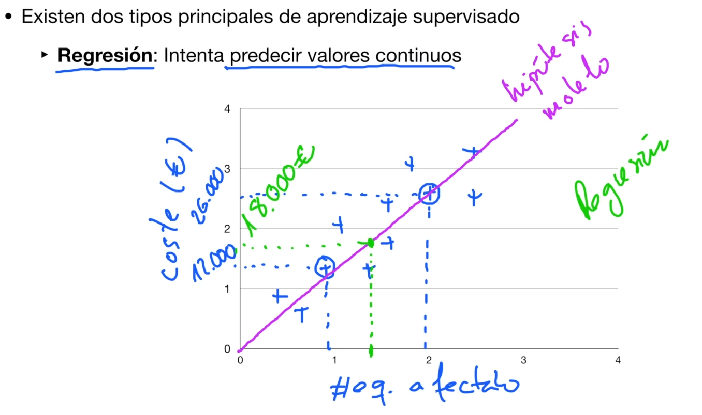
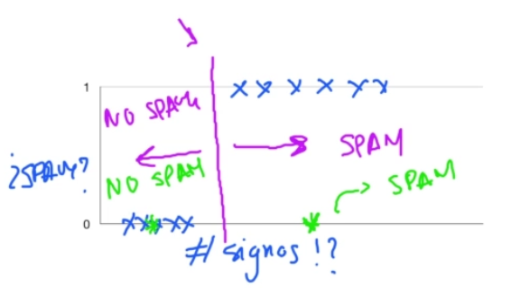
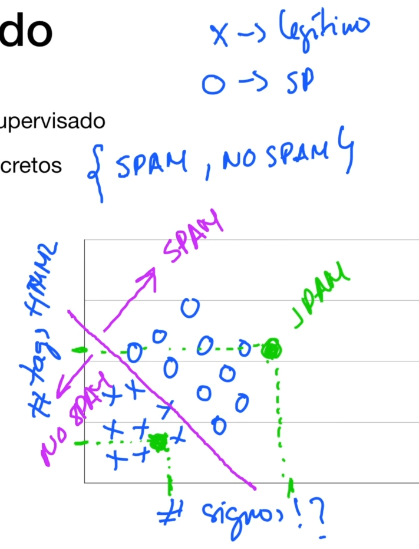
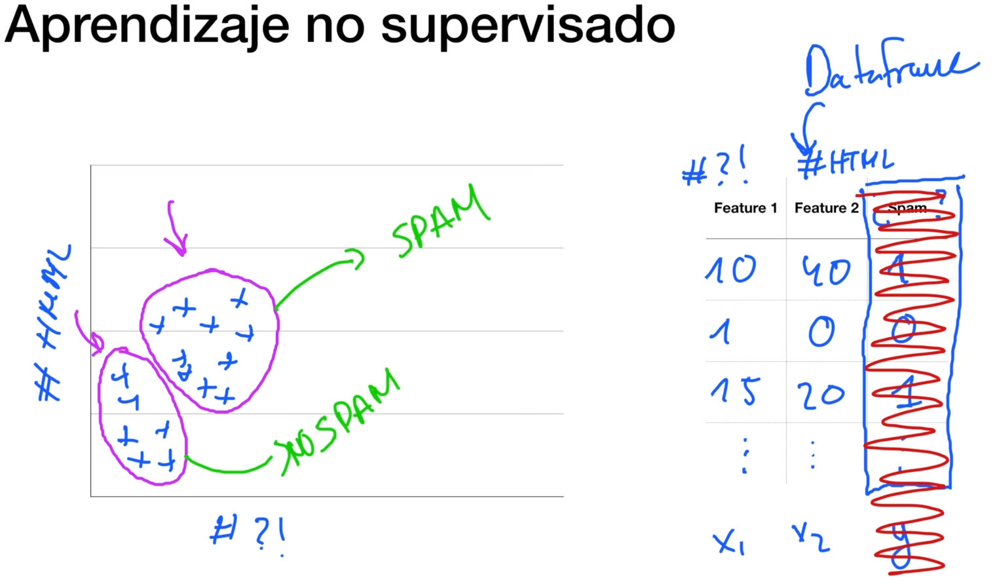

# Redes Neuronales Artificiales Profundas -

Esta es la forma de Categorizar los algoritmos y las técnicas de **Machine Learning**. Y es la primera de las tres grandes categorías que se vió anteriormente.
Esta categoría clasifica los algoritmos de **Machine Learning** en base a la forma en la que aprendían. 
Teníamos 4 subcategorías principales
- Aprendizaje supervisado
- Algoritmos basados en aprendizaje NO-Supervisado
- Aprendizaje SEMI-Supervisado
- Apredizaje Reforzado

**Aprendizaje Supervisado y No Supervisado:** La mayoría de las aplicaciónes en el mundo real se basan en uno de éstos dos.

## Aprendizaje Sueprvisado (son los más usados)
Es la tarea de aprendizaje automático que consiste en aprender una función que mapea una entrada a una salida basada en pares de *entrada-salida* de ejemplo.
La función resultante es usada posteriormente para predecir valores a partir de ejemplos de datos no etiquetados.

En el diagrama de modelo hay conceptos importantes.
El primero es que el **Aprendizaje Supervisado** es un tipo de técnica que consiste en aprender una función que va a mapear una **entrada** a una **salida** basada en pares de **entrada-salida de ejemplo**.
En el diagrama teníamos **experiencias pasadas**, teníamos características que proporcionabamos a un algoritmo y éste algoritmo era capaz de predecir el coste que tendría un posible incidente. 
Todos esos pasos implicaban aprender una función, estabamos generando un modelo que iba a mapear una entrada (conjunto de atributos) con una salida y todo esto en base a un **Conjunto de pares entrada-salida**.
Entonces, éste tipo de algoritmos, requiere que nosotros le proporcionemos datos que deberán estar **etiquetados**.

**Datos Etiquetados:** *consiste en un conjunto de datos en el que tenemos las variables de entrada, en el ejemplo de "casos de incidentes" tenemos el numero de equipos y numero de vulnerabilidades por equipo*. Pero tenemos la variable de salida, es decir la variable que nos gustaría que nuestro algoritmo o nuestro modelo fuera capaz de predecir, en el ejemplo sería el coste de los incidentes pasados que tuvo la organización en concreto.

Entonces, los algoritmos basados en **aprendizaje supervisado** van a requerir que nosotros le proporcionemos un conjunto de datos etiquetado, ess decir que le proporcionemos un conjunto de datos pasados en el que tengan las variables de entrada y la variable de salida. Y en función de ese conjunto de datos (*de pares de entrada-salida*), él va a generar una función (*que es lo que llamamos **Modelo***) y que va a ser capaz de, a partir de atributos de entrada, predecir la variable de salida.

*El **Conjunto de datos de entrenamientos debe estar Etiquetado**. La **función hipótesis** también es llamada **Modelo***

Existen 2 tipos principales de aprendizaje supervisado. La diferencia entre ambos es que los primeros intentan predecir valores contínuos.
- **Regresion**
- **Clasificación**

### Regresion
Intenta predecir valores continuos. Es decir que intentan predecir un conjunto o un valor que se encuentra dentro de un conjunto muy ampliio de valores, por ejemplo el precio de un incidente de seguridad que puede encontrarse dentro de un rango muy amplio porque podríamos tener un equipo afectado por una vulnerabilidad con un costo de €1.000 o un costo de €100.000 por 100 equipos afetados (*osea que puede ir de cero a millones*).

Para el ejemplo tomamos el número de equipos afectados y lo ponemos en un eje "X" y luego la **etiqueta** o variable de salida, que sería el costo del incidente, a éste último lo ponemos en el eje "Y".
Si obtenemos un **conjunto de datos**, éstos se van a ver como las cruces distribuidas en el gráfico.
Para el primer círculo el ejemplo es de una organización "A" con 900 equipos afectados con un cosot de €12.000 y un segundo circulo con otra organización "B" con 2.000 equipos afectado y un costo de remediación de €26.000. Este conjunto de datos es el que vamos a proporcionar al algoritmo con la **etiqueta de entrada**, en éste caso **el número de equipos afectados** y el **valor de salida** (que sería la **etiqueta de salida**) que es el **costo del incidente**.
El objetivo es que nuestro algoritmo sea capaz de construir nuestra **Función hipótesis o Modelo** de manera que pasandole el número de equipos que se ven afectados, sea capaz de predecirme el costo de ese posible incidente.
El **Algoritmo** lo que hace, es construir una **función** que va a ser lineal como se muestra en el gráfico, justamente porque la tendencia en la distribución de los datos, es lineal. Y se va a ajustar lo máximo posible a nuestro conjunto de datos de entrenamiento. Y es ésta función lo que llamamos **Función Hipótesis o Modelo**.
Y que se hace con ésta **Función Hipótesis o Modelo**? Lo que se hace es predecir futuros incidentes en base a esa variable de entrada. Pr ejemplo, si le digo que hay 1500 equipos afectados, cuál sería el costo del incidente de seguridad?
El algoritmo lo que haría es en base a esa **Función** que creó cuando le proporcionamos el conjunto de datos de *pares de entrada-salida*, es realizar una predicción y nos dirá que aproximadamente se vería o tendría un coste de ese incidente de €18.000.

Entonces cuando hablamos de **Aprendizaje Supervisado** y concretamente de **Regresión**, normalmente lo que hace es, en base a un **Conjunto de datos etiquetado**, va a generar una **Función**, en éste ejemplo generó una recta y esa **Función Hipótesis o Modelo** nos va a servir una vez que se a ajustado a la tendencia del **Conjunto de Datos**, nos va a servir para predecir futuros casos en base únicamente a la variable de entrada (*en éste caso el numero de equipos afectados*).

### Clasificación
Intenta predecir valores discretos.
Existen otro tipo de problemas en los que el algoritmo o nuestro modelo, nuestra función hipótesis intenta predecir valores discretos. Es decir, valores que se encuentran dentro de un rango muy acotado de valores.
En el ejemplo práctico tratamos de construir un filtro de spam para predecir si un correo concreto es o no, legítimo. 
Se intenta predecir: 1. Es Spam; 2. NO es Spam.

En el ejemplo tomamos una sola característica y vamos a recopilar un conjunto de mails spam y un conjunto de mails que no son spam (*los conjuntos de datos ya se encuentran etiquetados*). De éstos 2 conjuntos de mails vamos a extraer una característica, por ejemplo el número de signos de exclamación y de interrogación.

Vamos a presuponer que los emails que suelen tener un mayor número de signos de exclamación y de signos de interrogación que los correos legítimos y lo que trataremos de predecir, al igual que anteriormente teníamos los "costos o precios", ahora tendremos en el eje "Y" con un rango acotado la variable si ES-SPAM o NO-SPAM.
Si tomamos nuestro conjunto de emails y los representamos, en el gráfico tendríamos las cruces sobre el cero o sobre el 1 para indicar spam y no-spam.

El gráfico muestra que si tenemos un correo en el que tiene un número de signos d einterrogación y de exclamación elevado, tiee más probabilidades de ser un spam, sin embargo si tenemos un email con menos signos de exclamalción e interrogación tiene menos probabilidades de ser spam.

Hastá acá lo que hicimos es tomar un **Conjunto de emails**, lo clasificamos como spam y no-spam, hemos extraído de ellos una característica que es el número de signos de exclamación e interrogación y l ohemos representado gráficamente.
Y éste es el conjunto de datos que tenemos etiquetado que le vamos a proporcionar a nuestro algoritmo de **Machine Learning**.
Este algoritmo lo que va a hacer es construir una función hipótesis o un modelo como el que se ve en la imagen, donde una linea recta (que sería la función que se generó), lo que nos va a decir el algoritmo es que todo lo que se encuentre  la derecha de la función lo vamos a considerar un spam y lo que esté a la izquierda lo vamos a considerar no-spam. Esta función la genera en base al conjunto de datos que le pasamos.

Ahora, qué nos va a permitir esto?
Nos va a permiti que en un futuro, nosotros tomemos un nuevo email y que de él se realice una extracción de la **característica de entrada** que nos interesa, que es el número de signos de exclamación e interrogación y vayamos a evaluarlo con nuestra función o modelo.
Por ejemplo, en verde se muestra que si el nuevo email tiene un valor que está hacia la derecha, el algoritmo nos va a decir que es un spam, sin embargo, si se encuentra a la izquierda nos dira que es legítimo.

Y es de ésta manera cómo funcionan los algoritmos basados en **Aprendizaje Sueprvisado** y concretamente en **Clasificación**.

Este ejemplo se puede extender a más características, a mas valores de entrada y no solamente a un solo valor como los signos de interrogación.
Por ejemplo podemos extraer los signos de exclamación e interrogación y los taggs html. Si los extraemos y los representamos gráficamente, en la imágen las "x" serían los emails legítimos y los "o" son los spams.
El comportamiento acá es que mientras más cantidad de taggs html tenga, hay más probabilidades de que el email sea spam y menos probabilidades que se corresponda que sea un email legítimo. Lo mismo pasa con los signos, mientras más signos de interrogación y exclamación tenga, suben las probabilidades de que el email sea spam.
Ahora lo que hace un algoritmo de **Aprendizaje Supervisado** es, al igual que en el caso anterior, va a construir una funcón hipótesis o un modelo. En éste caso la función o modelo es una linea endiagonal que separa las "x" de los "o", de manera que todo lo que se encuentre a la derecha lo va a considerar spam y lo que esté a la izquierda lo va a considerar como legítimo.
Entonces, cuando llegue un nuevo email lo que haremos es extraer de ese email las dos características que elegimos (tags html y signos) y si cae a la derecha lo clasificará como spam y si cae a la izquierda, lo clasifica como legítimo.

### Conclusión
Los algoritmos de **Aprendizaje Supervisado basados en Regresión** van a tratar de predecir un valor contínuo dentro de un rango muy amplio de valores y se van a diferenciar de los **Aprendizaje Supervisado basados en Clasificación** en que los de clasificación tratan de predecir un valor discreto en un rango muy acotado de valores.

## Aprendizaje NO Supervisado

Es la tarea de aprendizaje automático que consisteen inferir una función que **describe la estructura de un conjunto de datos sin etiquetar**, es decir, datos que no se han clasificado ni categorizado.
En éste tipo de aprendizaje tambien se busca **inferir una función hipótesis o modelo** pero no hace la inferencia en busca de una predicción, sino que intenta **describir la estructura de un conjunto de datos sin etiquetar**, esto último quiere decir que no se trata de un par de datos de entrada-salida como el ejemplo anterior, sino que **se le pasa sólo variables de entrada**.
Entonces, el **Modelo** en éste tipo de aprendizaje ya NO nos daría como resultado una predicción, sino que nos proporcionará una **Descripción de la Estructura del Conjunto de Datos** que metimos como entrada.
Osea, que de éstos datos de entrada nos dirá como se distribuyen de acuerdo a patrones determinados.

Estos tipos de algoritmos son muy útiles para conjunto de datos muy grandes como por ejemplo logs de un servidor y si tratamos de encontrar patrones dentro de esos logs, a simple vista es complicado encontrar esos patrones, sin embargo usando un algoritmo basado en **Aprendizaje NO Supervisado** para proporcionarle éste conjunto de datos que nosotros no podríamos etiquetar y no sabemos si los logs son maliciosos o legítimos.
Y de ésta manera podríamos analizar esos logs y darle un sentido

### Caso Práctico
Ejemplo del filtro de spam usando un data frame mostrado con pandas.
Si usáramos **Aprendizaje Supervisado** tendríamos como herramienta auxiliar una tabla donde tendremos en una columna los signos, en otra los taggs html y una tercera con el resultado (spam o no-spam), 1 =  es spam y 0 = no-spam. Pero usando **Aprendizaje NO Supervisado** no tendríamos la tercera columna con los resultados de si es o no un spam (*No endríamos la salida*).
Si tuvieramos sólo las entradas y las representamos en una gráfica se muestran todos los mail, pero no sabríamos cual es cuál. Entonces lo que haremos es agarrar todos éstos datos, meterselos al algoritmos y decirle que  genere una función que describa los datos que le metimos y busque similitudes y diferencias entre los datos, proporcionandoles una estructura y despues yo analizaré esa estructura que generó el algoritmo. 
En el ejemplo, el algoritmo generaría una función hipótesis similar a la que se muesrta en el gráfico, en la que proporciona una estructura  dividiendo el conjunto de datos en 2 grupos en función de las relas internas que genera el algoritmo y de esa función, en base a las características de entrada que le pasamos (taggs html y signos) y las similitudes que hay. determina los dos grupos.
El analista analizaría los grupos resultantes.

### Conclusión
Los algoritmos basados en **Aprendizaje Supervisado** recibirán un conjunto de datos etiquetado en el que van a tener no sólo las variables de entrada, sino tambien la salida y van a construir una función hipótesisi o modelo con el que van a ser capaces de hacer predicciones a partir de valores de entrada de un ejemplo nuevo.
Mientras que algoritmos basados en **Aprendizaje NO Supervisado** van a recibir un conjunto de datos sin etiquetar, es decir un conjunto de datos en el que solo están las variables de entrada y a partir de ellas va a generar una función que proporcionará una estructura a ese conjunto de datos, y un analista después puede tomar esa estructura y analizarla para intentar ganar intuiciones.

