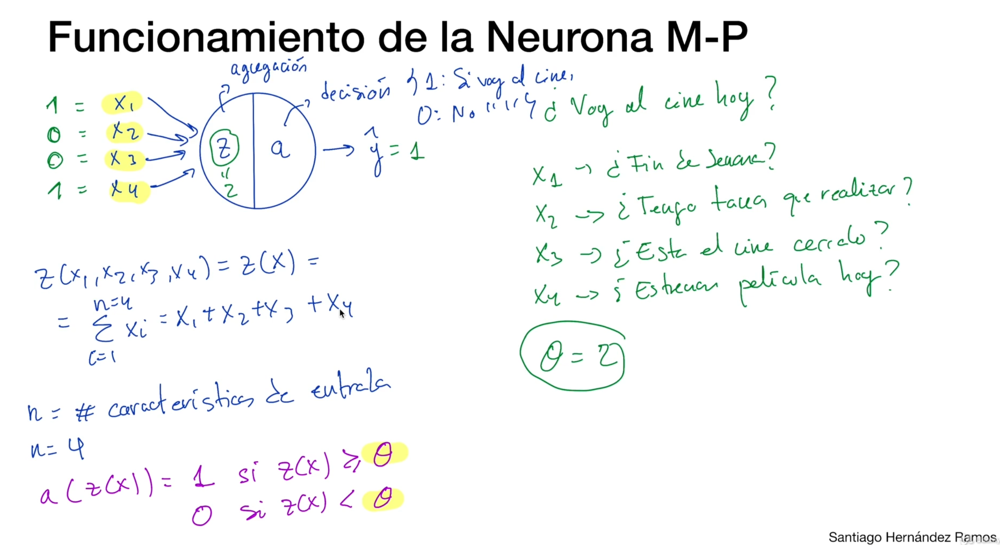

# Que es una Red Neuronal Artificial (RNA)
Es un tipo de algoritmo de **Machine Learning** inspirado en las redes neuronales biológicas, ésto significa que aunque la "inspiración" viene de las neuronas bilógicas, no significa que esté implementado de la misma manera y no funcionan de la misma forma que funciona nuestro cerebro.
Es el componente principal del **Deep Learning**, tiene diferentes arquitecturas, diferentes capas de neuronas, diferentes neuronas, funciones de activación, componentes diferentes. Y todos los algoritmos se basan en **Redes Neuronales Artificiales**

Contexto histórico:
- Se introducen por primera vez en 1943 por el neuropsicólogo *Warren McCulloch* y el matemático *Walter Pitts*.
- Alrededor de 1990 pierden interés a favor de técnicas de **MachineLearning** como el **Support Vector Machine**.
- En 2012 resurgen con más fuerza que nunca cuando Geoffrey Hinton gana el reto **ImageNet** con una Red Neuronal Convulcional.

## Porqué surgen las RNA?
- En la actualidad existe una gran cantidad de datos disponibles
- En las últimas décadas el poder computacional se ha multiplicado, permitiendo la ejecución de algoritmos costosos y complejos en periodos de tiempo razonables
- Los algoritmos en los que se basan las Redes Neuronales Artificiales han mejorado.
- Muchas limitaciónes que se habían intuido de manera teórica resultaron no cumplirse en la práctica.

## La Primera Neurona Artificial (Neurona M-P)
La que inventó McCulloch y Pitts en 1943.
- Comunmente es llamada **Neurona M-P**, M-P es por las iniciales de los creadores, es la primera de la historia.
- Se caracteriza por recibir uno o más valores binarios {1, 0}, es decir que va a recibir todas las características de entrada que nosotros queramos, pero el valor que van a recibir estas características de entrada debe ser 1 = si o 0 = no y retorna (*o predice*) otro valor binario {1, 0}, es decir que va a ser capaz de tomar una decisión que sea "si" o "no".
- Activa su salida cuando más de un número determinado de valores de entrada se encuentran activos. Qué significa que la neurona se active o que los valores de entrada se encuentren activos?
**activos** quieren decir que son igual a 1 (en éste caso). Entonces, si tenemos un número de valores de entrada (de características de entrada). Por ejemplo 5 características de entrada que sean igual a 1, esa neurona se activará y por lo tanto el resultado de la variable de salida va a ser también igual a 1.
En el caso de que el número de características de entrada que son igual a 1 no sea mayor o igual a 5, entonces lo que pasará es que esa neurona n se activará y por lo tanto esa variable de salida, ese output de la función, esa predicción será igual a cero.

Bueno, éste número de valores o características de entrada a partir de la cual la neurona se activa, tenemos que establecer de manera manual y concretamente este número se va a denominar **Threshold**.
Un **Threshold** es un límite y es una cosa muy común y que se utiliza con muchos algoritmos de AI, un límite a partir del cual pasa algo.
En éste caso ese **Threshold** lo que nos marca es el límite a partir del cual la neurona se activa. Si nuestro **Threshold** es igual a 5 quiere decir que tiene que haber al menos 5 características de entrada, 5 variables de entrada que sean igual a 1 para que esa neurona se active, para que el output de la neurona sea también igual a 1.

## Funcionamiento de la Neurona M-P
Comúnmente las **Neuronas Artificiales** suelen representarse con un círculo. En el ejemplo se ve un círculo (*la Neurona*) y va a recibir una serie de inputs binarios y nos va a proporcionar un output, o predicción que también va a ser binaria.
La neurona va a estar formada por **dos funciónes**, por eso se divide la neurona en 2.
**La primera Función** la llamamos **"Z"** y va a consistir en una función matemática que va a realizar agregación de los inputs.
**La segunda Función**  la llamamos **"A"** y va a ser la función de activación, ésto quiere decir que va a tomar una decisión en base a la **Agregación** que ha realizado la función anterior.

## Cómo funciona?
Supongamos que por ejemplo, la decisión que quiero tomar es una decisión cotidiana y quiero que la neurona responda la pregunta de si *"Hoy voy a ir al cine?"* y quiero que mi neurona me responda "por si o por no" (como massa jajajjajaja).
Ahora para responder a ésta pregunta la neurona va a requerir una serie de valores (o características) de entrada. 
En éste caso las caracterísitcas de entrada que yo voy a definir, a partir de las cuales la neurona tiene que tomar una decisión, van a ser:
- X1: *"Es fin de semana?"*
- X2: *"Tengo treas que realizar?"*
- X3: *"Esta el cine cerrado?"*
- X4: *"Estrenan pelícla hoy?"*

A partir de éstas caraccterísticas de entrada, donde sólo pueden tener un valor binario.
Entonces **"Z"** recibe las características de entrada y si la neurona responde 1 es que "si" y si devuelve un 0 es un "no".
En el gráfico se pueden ver cómo están conformadas las funciones y para saber si vamos al cine o no, marcamos el **Threshold** (representado por **"o"**) manualmente en 2. 

## Características de entrada y Limitaciones de la Neurona M-P
Ahora, del ejemplo anterior, si se diera el caso de que **"X3: El cine esté cerrado"**, por más que la neurona devuelva un 2, debería decirme que no... si o si.
Entonces para éste tipo de característica se M-P definieron 2 tipos para las características de entrada que se denominan como:
- Inputs excitadores: X1, X2 y X4. Son los que activan las neuronas. Estos son los que se suman todos
- Inputs inhibidores: X3. Cuando un inhibidor se activa, en éste caso **"El cine esté cerrado"**, entonces esa neurona siempre va a devolver cero, es decir que no se va a activar la neurona independientemente del valor que reciban el resto de inputs. Cuando se activa un input inhibidor, la neurona básicamente no se activa y devuelve siempre cero.
Esta neurona, aunque es simple, ya nos permite tomar ciertas decisiónes. De hecho nos permite representar ciertas puertas lógicas, operaciónes lógicas, como por ejemlo la funcion AND o OR.

## Limitaciónes de la Neurona M-P
- Recibe únicamente valores binarios {1, 0}, en la mayoría de los problemas reales se dispondrá de valores de otros tipos.
- Requiere la selección del **Threshold** de manera manual
- Todas las entradas son iguales. No se le puede asignar un mayor peso a una de las entradas
- No son capaces de resolver problemas que no sean linealmente separables, por ejemplo la operación XOR.