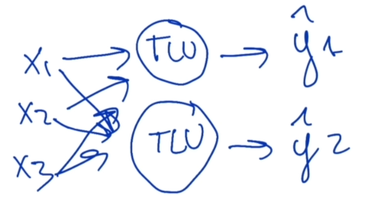
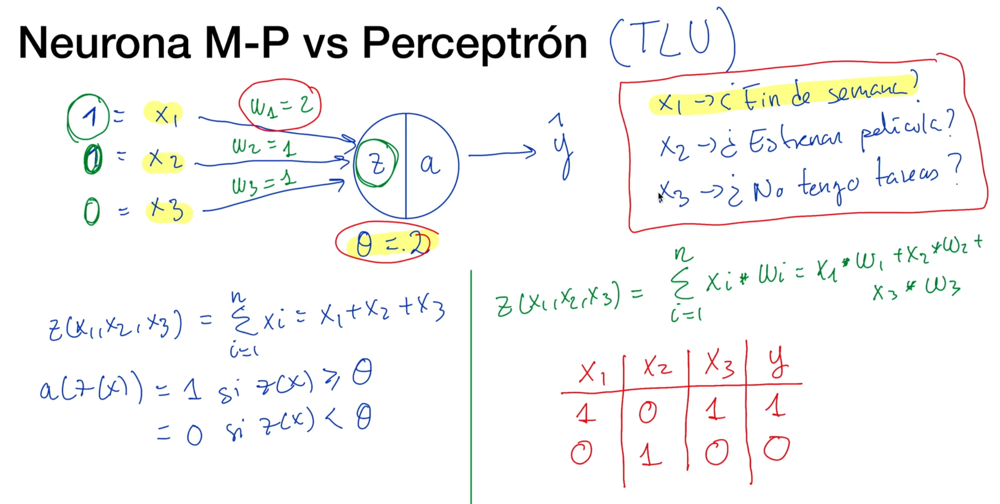
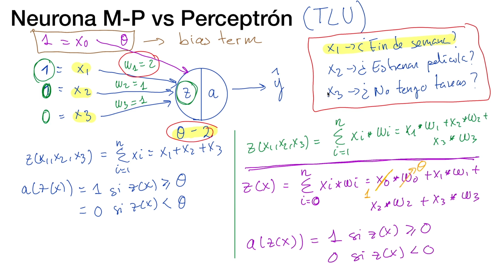

# Perceptrón
Es la evolución de la **Neurona M-P** y tiene un mejor algoritmo. Este es uno de los algoritmos más conocidos dentro del **Deep Learning** y sienta las bases de muchas de las arquitecturas de **Redes Neuronales Artificiales** de las que disponemos en la actualidad.
- Fué propuesto por Frank Rosenblatt en 1958. 

- En 1969 fue refinado y analizado por Marvin Minsky y Seymour Papert. `Marvin, M., & Seymour, A. P. (1969). Perceptrons.`

- Mejora el planteamiento de la neurona de McCulloch y Pitts añadiendo el concepto de "peso" numérico a las entradas y planteando un mecanismo para ajustarlos. 
Ej. Si recordamos el ejemplo de la primera neurona ante la pregunta "Hoy voy a ir al cine?" recibíamos una serie de inputs binarios que se correspondían a respuestas a preguntas como: si tenia tiempo hoy, si era fin de semana, etc.
En éste ejemplo nos encontramos que habían preguntas que podían tener más importancia que otras, por ejemplo si estaba abierto el cine o no.
En la **Neurona M-P** no podíamos agregar más o menos importancia a las respuestas.
Bueno, ésto es lo que mejora el **Perceptrón**, porque ya incorpora este concepto de peso (*o importancia*) y no sólo eso, sino que además plantea un mecanismo para encontrar esa importancia (*o ese valor de importancia*) de manera automática.
Y éste concepto para ajustar los pesos o importancias (*posiblemente ideales*) es lo que se conoce como **Aprender**. Es decir que sería el proceso de entrenamiento.
Por lo tanto **cuando entrenamos nuestra neurona artificial, lo que hacemos realmente es encontrar esos pesos ideales para que la neurona realice buenas predicciones. Estos pesos se denominan parámetros del modelo.**

- No recibe únicamente valores de entrada binarios, permite valores de entrada reales. 
La **Neurona M-P** sólo permitia tomar decisiónes binarias, ahora con la introducción del **Perceptrón** no sólo permite recibir valores binarios, sino que permite recibir valores dentro de un rango más amplio. También nos permite realizar predicciones que no sean una decisión binaria (*es decir que el output no sea sólo un valor binario*).

- Se basa en un tipo de neurona artificial conocida como **Threshold Logic Unit (TLU)**
Hay que aclarar que el **Perceptron** no es un algoritmo que se base en una única neurona artificial como la **Neurona M-P**, sino que consiste en un algoritmo que está constituido por varias neuronas artificiales y cada una de éstas se denomina **Threshold Logic UNIT**.
Esto quiere decir que en nuestra arquitectura, nuestro perceptron puede estar formado por varias neuronas.
Por ejemplo, si en nuestra arquitectura, nuestro perceptron puede estar formado por varias neuronas que llamaremos en el ejemplo gráfico **TW**, y si tenemos varios inputs (x1, x2, x3). Estos inputs entrarán a las diferentes neuronas y las diferentes neuronas nos proporcionarán diferentes resultados que tendremos que interpretar.
Es decir el **Perceptron** tal y como lo vemos **es una arquitectura de Red Neuronal Artificial** y que no tiene porque estar formado por una única neurona y las neuronas que lo forman se denominan **TLU - Threshold Logic Unit**.

- La TLU computa una **suma parametrizada** de las entradas.

## Neurona M-P vs Perceptrón (TLU)
En el gráfico se muestra una **Neurona M-P** que para repasar su funcionamientos se puede ir a la docu `"5A_RNA_Red_Neuronal_Artificial.md"`. Ahora si quisiéramos complejizarla y agregar valor a algunas de las preguntas del ejercicio.
Por ejemplo, si la pregunta de si "es fin de semana?" es importante (por si tenemos tareas que realizar, donde si es un viernes o un sábado podríamos tener un día más para realizar la tarea), con este ejemplo lo que buscamos es que esa pregunta, o ese valor de la variable **X1** de si *es fin de semana?*, tenga un **peso mayor** que si *estrenan pelicula?* (porque da igual que estrene pelicula, si tengo tarea que realizar y si no es fin de semana porque voy a tener que entregar la tarea y tengo que hacerla). Bueno, aquí es donde se incorpora el concepto de **importancia o peso** mencionado para el **Perceptron**.
Entonces, éste peso, en el ejemplo va a venir marcado con **W1, W2, y W3** y cada uno de los valores de entrada (*x1, x2, y x3*), van a tener asociado un peso, de manera que se puede establecer ese peso para que esas variables de entrada valgan más o valgan menos.
Por ejemplo, si yo quiero que *fin de semana?* valga más, le asigno un peso mayor que al resto de variables. En éste caso, puedo decir que **W1** sea igual a 2, mientras que el peso del resto de variables sea 1.
Ahora la **función Z** ya no va a ser una **agregación** (una suma de todas las entradas), sino que va a ser una suma parametrizada en base a esos pesos.

Todo este cálculo se ve a la derecha en el gráfico, escrito con verde y rojo.
En el ejemplo se vio como lo calcularíamos de forma manual, pero la diferencia fundamental entre la **TLU** que forma el **Perceptrón** y la **Neurona M-P** es que éstos pesos no se elijen de manera manual. 
Es decir, vamos a usar un algoritmo que va a seleccionar éstos pesos de manera automática en base a **Experiencia pasada**.
Cómo lo hacemos?
Agarramos las últimas 20 veces que fuimos al cine, extraemos estas 3 preguntas de esas 20 veces que fuimos al cine. Entonces extraemos las respuestas (si/no) de las preguntas de la experiencia de las ultimas 20 veces pasadas, y con ésto formamos una tabla que llamaremos **Conjunto de Datos** y estará formada por ésas características de entrada, de la experiencia pasada y la variable de salida, es decir "si fuimos o no".

Entonces, lo que hacemos es tomar un **Conjunto de experiencias pasadas** se lo proporcionamos a nuestro algoritmo y en base a estos datos pasados, el algoritmo de manera autónoma va a ser capaz de identificar estos pesos, la importanci que tiene cada una de esas variables de entrada o cada una de esas preguntas para nosotros en particular.

## Perceptrón y eliminación del Threshold
La diferencia entre la **Neurona M-P** y el **Perceptron**  no se limita a los pesos y a la forma de aprenderlos de manera automática, sino que también trata de mejorar el concepto de **Threshold**, ya que anteriormente el **Threshold** se definia de forma manual, ahora se intenta calcularlo a partir de **Experiencia pasada**.
Entonces se empieza a considerar al **Threshold** como una improtancia más, es decir como un peso más para una característica que va a ser igual a uno.
Entones, se crea una **nueva caracterísitca de entrada, X0**, que siempre va a ser igual a uno y que va a tener asociado como peso el **Threshold**, de manera que ese mismo algoritmo que usábamos para ajustar el valor de la importancia de los pesos **W1, W2, y W3** de manera automática, tambien sirva para seleccionar ese **Threshold** de manera automática en base a esa experiencia pasada.
Entonces la funcion de agregacion (la verde) donde se multiplicaba las "X" con las "W" y se sumaban, va a cambiar y la sumatoria de Z, desde x1 a xn, va a ser ahora la sumatoria desde x0 a xn. Donde "X0" va a ser siempre 1.
De ésta forma la **función a** también cambia.
Hay que aclarar que en la literatura éste nuevo **Threshold** que es el **X0** se lo va a encontrar como **BIAS** (*se lo denomina como término de prejuicio o parcialidad*).
**BIAS** se lo denomina como término de prejuicio o parcialidad porque de manera intuitiva éste término establece ese concepto de parcialidad entre, por ejemplo, una persona que le guste muchísimo el cine entonces este **Bias o nuevo threshold** va a ser muy pequeño porque las probabilidades de ir al cine van a ser mayores, y ésto lo va a aprender de la experiencia pasada. En cambio a alguien que le importa poco ir al cine, el **bias** le va a salir alto porque quizas para que vaya necesite que se le alineen todos los planetas, la luna esté en júpiter, que tenga ganas, plata, que vaya obligado entre otras "casualidades" que lo obliguen a ir al cine.
Entonces este **bias** va a ser clave para juzgar en la decisión.

## Threshold Logic Unit (TLU)
- La TLU computa una **suma parametrizada** de entradas. Esto es porque le multiplicamos el peso de la característica de entrada.

- Después, aplica una **función de activación** sobre la suma calculada anteriormente.

En el gráfico **b** es el **Bias**.
