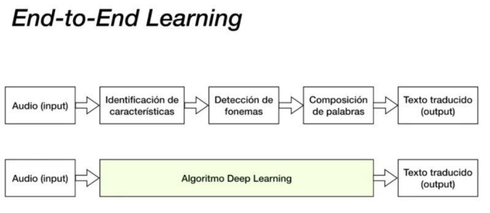

# Deep Learning
**Guía:** - Qué es. - "end to end learning". - Algoritmos de Deep Learning. - Algoritmos de Machine Learning.

## Machine Learning

### Comienzos del Machine Learning
- Desde los inicios, la AI abordó y resolvió problemas intelectualmente difíciles para los humanos pero reltivamente sencillos para las computadoras.
- El reto para la AI resultó ser resolver tareas que son fáciles para los himanos pero difíciles de describir formalmente
- El **Machine Learning** es una disciplina.
- **El rendimiento de estos algoritmos de aprendizaje automático depende en gran medida de la representación de los datos que se les proporciona.**. *Ejemplo: se se usa un algoritmo de **Machine Learning** para diagnosticar a un paciente, el sistema de AI no examina al paciente directamente, en su lugr, el médico le indica al sistema varios datos relevantes, como la presencia o ausencia de determinados síntomas.*

### Qué es el Machine Learning?
El aprendizaje automático es un subdominio de la AI que proporciona a los sistemas la capacidad de aprender y mejorar automáticamente a partir de la experiencia pasada **sin ser explícitamente programados para ello.** Se basa en la hipótesis subyacente de **crear un modelo** y tratar de **mejorarlo ajustando más datos en ese modelo** a lo largo del tiempo.
Es decir, se le va  aproporcionar datos pasados y se van a ajustar de manera automática una serie de parámetros, de manera que van a poder realizar predicciones para ejemplos que no se encontraban en esa experiencia pasada tomando una determinada decisión.

### En qué consiste la creación de un Modelo?
Los componentes a más alto nivel fundamentales de una técnica de **Machine Learning** son:
- Conjunto de Datos de Entrenamiento: Se trata de la experiencia pasada.
- Algoritmo de Aprendizaje:
- Hipótesis:

~~~
                                              X
                                              ↓
|-------------|    |-------------------|    |---|
|Conjunto de  |--> |Algoritmo de       |--> |   | Modelo
|datos de     |    |  aprendizaje      |    | H |
|entrenamiento|    |(funcion hipótesis)|    |   |
|-------------|    |-------------------|    |---|
                                              ↓
                                              Y (predicción)
~~~

Acá lo que hace el **Machine Learning** es: 
A partir de un **Conjunto de Datos de Entrenamiento**, se entrena un algoritmo de Machine Learning para que aprenda de ese **Conjunto de Datos de Entrenamiento** (experiencia pasada), y construya una representación interna, ajuste una **función** matemática, unos parámetros, de manera que sea capaz de realizar buenas predicciones.
Ese **ajuste de parámetros** es lo que se conoce como el **proceso de aprendizaje** y concretamente la función que se va a ajustar, es decir, la función mtemática que tiene esos parámetros que van a ir aprendiendo, que van a ir modificando su valor para ajustarse a esos datos pasados, es lo que se conoce como **Función Hipótesis**.
Ahora, cuando se toma esa experiencia pasada y se la proporcionamos a nuestro algoritmo de **machine learning** o de **deep learning**, nuestro algoritmo de aprendizaje lo que va a hacer es comenzar un proceso de optimización en el que va a ir modificando esos parámetros mencionados anteriormente y va a ir aprendiendo de esa experiencia pasada.
Una vez que termina de aprender, una vez que ajusta esos parámetros, lo que obtendremos es una **Función Hipótesis Ajustada** o un **Modelo** correspondiente con el componente **H**.
Al obtener construido ese **Modelo** abremos encontrado el valor "ideal" de esos parámetros que ajustan la **Función Hipótesis** a la tendencia de nuestro **Conjunto de Datos de Entrenamiento** de nuestra experiencia pasada.

Luego el **Modelo** cuando ya empieza a recibir ejemplos o instancias nuevas (*En el gráfico las instancias nuevas se representan con **X***) que no se encontraban en esa experiencia pasada, podemos empezar a realizar predicciones para esas instancias nuevas.

*Explicado con el ejemplo de los pacientes.
El conjunto de datos (experiencia pasada) se corresponderían con datos de pacientes que en su momento sufrían una enfermedad y para los que habíamos extraído una serie de síntomas.*
*Tomamos esa experiencia pasada, la proporcionamos a un algoritmo de **Machine Learning** éste, aprendió y construyó un **Modelo**, el cual al obtener los síntomas de un nuevo paciente, realiza predicciones que se ajustan a lo que teníamos en nuestro conjunto de datos de experiencia pasada.*

## End-to-End Learning
Es un concepto que surge como consecuencia de un problema que tenemos con las caracteristicas de entrada cuando se habla de técnicas de **Machine Learning**

### Problema de las características de entrada
- **El rendimiento de los algoritmos de Machine Learning depende de la representación de los datos que se les proporciona.**. Para éste aspecto es imprescindible un analísta experto que seleccione los datos necesarios para el entrenamiento. *En el ejemplo de los pacientes, para poder tener un conjunto de datos adecuado se requiere un experto que conozca tanto los síntomas como las enfermedades vinculadas a esos síntomas.*

- Muchas tareas pueden resolverse diseñando un conjunto adecuado de características a extraer para esa tarea y proporcionándolas a un algoritmo de **Machine Learning**.

- **Hay tareas para las cuales es difícil identificar qué características deben ser extraídas**.(*Por ej: supongamos que quisiéramos escribir un programa para detectar coches en fotografías. Sabemos que los coches tienen retrovisores, por lo que nos gustaría utilizar la presencia de un retrovisor como un característica. Desfortunadamente, es difícil describir exactamente cómo se ve un retrovisor en términos de valores de píxeles. Su imagen puede variar por las sombras, el sol al deslumbrar, un objeto...*)
*Otro ejemplo es que un auto, en una foto se ve distinto si en la foto el vahículo está de frente, de traste o de costeleta. Ahí es difícil poder definir cuáles son las características que tiene ese auto para que la AI lo entienda como que es un auto. Con características me refiero a los objetos que tiene, faros, retrovisores, patente, etc*

Para tratar de resolver éstos problemas surge una técnica que se llama **Representation Learning**

### Representation Learning
- Una solución a este problema es usar técnicas de **Machine Learning** para descubrir la mejor forma de describir los datos. Este enfoque se conoce como **Representation Learning.**

- El ejemplo por excelencia de un algoritmo basado en **Representation Learning** es el **Autoencoder.**

- A pesar de estas técnicas, en determinadas ocasiones, sigue siendo muy difícil extraer características de alto nivel y abstractas de los datos en bruto. Determinados factores, como el acento de un orador, pueden ser identificados únicamente teniendo una comprensión sofisticada, casi a nivel humano, de los datos.

- Cuando es casi tan difícil obtener una representación que resolver el problema original, las técnicas de **Representation Learning** no son de utilidad.

Cuando tratámos de transcribir a texto lo que hbla una persona en un audio, lo que se hacía usando técnicas clásicas de **Machine Learning** era: tomar el audio, identificar una serie de características de ese audio, se las proporcionaban a un algoritmo de **Machine Learning** con el que se hacía una detección de fonemas. Después se realizaba una composición de palabras y por último se obtenía ese texto traducido.
Cuando se habla de **End-To-End Learning** y concretamente de éste tipo de técnica es la que van a usar la mayoría de algoritmos de **Deep Learning**.
Y lo que van a hacer es recibir un audio en bruto, se lo proporciona al algoritmo de **Deep Learning** y éste algoritmo va a ser capaz de darnos como output el texto directamente traducido.
Toda ésta fase de **identificación, extracción de características** va a realizarla el propio algoritmo. Y esto es en lo que consiste el **End-To-End Learning.**

**Ver el Caso Práctico de End-To-End Learning**
*Hay diferencias entre Machine Learning y Deep Learning.*
