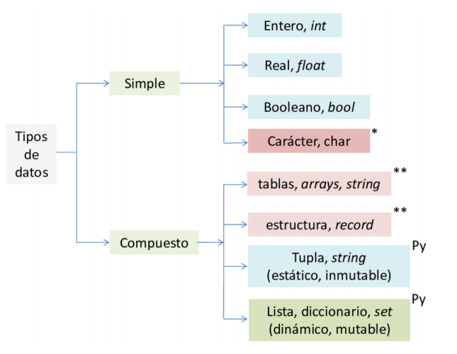
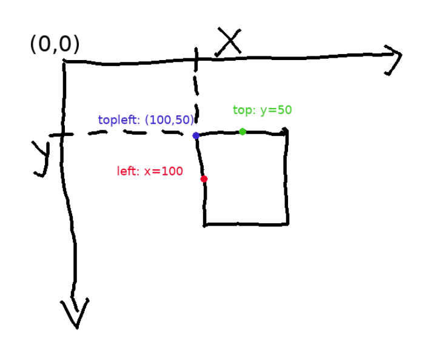
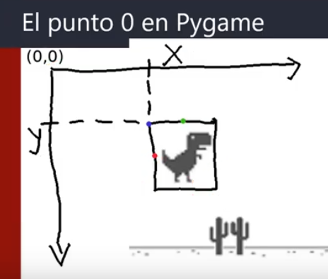

# Programación II
Objetivo:
- Comprender lenguaje Python
- Aplicar diferentes paradigmas de desarrollo en la resolución de problemas académicos y profesionales
Temario General:
- Introducción a Python
- Paradigma de Objetos
- Programación funcional, excepciones: funciones de orden superior, Iteraciones sobre listas, funciones lambda, listas, diccionarios, tuplas, generadores y decoradores.
- Archivos y expresiones regulares: modulos y paquetes para excepciones, entrada-salida estándar, archivos, expresiones regulares
- Librerías e introducción al Machine Learning: librerías para python, descripcion y ejemplos rápidos, introduccion a redes neuronales, aprendizaje, perceptron, función de activacion, red neuronal, back propagation.

## Contenidos mínimos
Usaremos conceptos como:
- **Base de Programación:** Estructuras de decisión, de repetición, de secuencias. Funciones, vectores, recursividad, etc.
- **Lógica:** Nivel de abstracción que permita resolver problemas usando un lenguaje de programación.
- **Paradigmas:** Diferentes modelos que podemos usar para desarrollar nuestro juego.
- **Librerías:** Funciones de Python muy útiles para crear nuestros juegos.
- **Lenguaje interpretado:** El proceso de traducción a **Lenguaje máquina** se hace cada vez que se ejecuta (no se requiere de un .exe).
- **Lenguaje Compilado:** El proceso de traducción se hace por única vez, luego de obtener el ".exe".
- **Programación Estructurada:** (*Paradigma imperativo*) Se define mediante subrutinas y flujos de control.
- **Programación Orientada a Objetos:** Se contruyen modelos de objetos considerando un nivel de abstracción según el problema a resolver.
- **Programación Funcional:** (*Paradigma declarativo*) Las funciones tienen un rol protagónico y podrán ser asignadas a variables, como entradas y salidas de otras funciones

## Clase I
### DIFERENCIA ENTRE POO Y PARADIGMA ESTRUCTURADO

Las diferencias se dan en el enfoque y la organizacion del codigo como abstraccion de la solucion a modelar. 
El paradigma estructurado se organiza en modulos o funciones, centrado en el uso de estructuras de control que definen flujos logicos a seguir casi en forma secuencial, asi mismo la manipulacion de los datos es directa y solo restringida por el ambito de declaracion de las variables.
En tanto el paradigma orientado a objeto, modela la solucion en bstracciones o clases, que estan en relacion directa con el dominio del problema a  resolver, las clases encapsulan datos y metodos, propiciando la reutilizacion de codigo, la modularidad y la encapsulacion de datos. 
Por ultimo el paradigma funcional, plantea la evolucion de funciones con una optica matematica, permitiendo anidamiento la asignacion a variables, ser pasadas como argumento o devueltas como resultados.

Aplicaremos distintos paradigmas de programación. Un **paradigma** se puede entender como un conjunto de acuerdos que guían al desarrollador al momento de sentarse a programar. El problema que tienen es que cambian con el tiempo, además hay algunos que están arraigados más a algúnas comunidades que otros, pero python nos permite trabajar con varios de ellos.
Necesitaremos seguir **algoritmos** que implica seguir una lógica y respetarla. El **algoritmo** se entiende como un conjunto ordenado de pasos (no ambiguos) que permiten obtener un resultado o encontrar la solución a un problema y debe respetar 3 premisas, debe ser:
- **Preciso:** Implica el orden de realización de cada uno de los pasos
- **Definido:** Si se sigue dos veces, se obtiene el mismo resultado
- **Finito:** Tiene un número determinado de pasos

### Python
Es un lenguaje interpretado o de *Script* con tipado dinámico, multiplataforma y orientado a objetos.


## Clase II
Como se vió, el algoritmo es una secuencia ordenada de pasos que se ejecutan en forma secuencial. Ahora lo que define el orden secuencial de ejecución es el **Flujo** que sería el recorrido que hace la compu al ejecutar cada línea de código, existen varias formas y una de ellas es el *diagrama de flujo*.

### Ambientes Virtuales
Permite encapsular en un proyecto todas las versiones de los paquetes que usamos. Una librería de ejemplo es *virtualenv*
```python
# Instalación de virtualenv
user@laptop ~$ pip install virtualenv

# Se crea el entorno de trabajo
user@laptop ~$ python -m virtualenv venv_tp1

# Por último se activa el entorno virtual
user@laptop ~$ ./venv_tp1/Scripts/activate
```
## Clase 3 - Estructuras de Repetición
Tranajamos con estructuras de repetición como:
- **for:** que repite un cantidad finita de veces.
- **while:** se usa generalmente cuando e necesita repetir un bloque de código pero con un número desconocido de repeticiones

## Clase 4 - Funciones
- **funcion:** es una unidad de código que se usa para una determinada tarea y hacen que el código sea más mantenible y legible. Hay funciones que ofrece el mismo lenguaje y están las de elaboración propia.
No todas las funciónes reciben **parámetro** y las que sí, pueden recibir uno o más. Estos parámetros son un **contenedor de posición que representa el orden de argumentos que recibe una llamada a una funcion**.
- **ámbito (scope):** es el código que está tabulado y representa el cuerpo de la función, las variables declaradas dentro no  existen fuera de él y son conocidas como **variables locales**

En python no existe la sobrecarga, pero se puede simular con la librería *multipledispatch* y el uso de **decoradores**.

## Clase 5 - Modulos, librerías y excepciones
Las **librerías** son archivos que continen un conjunto de funciones que escriben terceros y las disponibilizan para que podamos usarlas. Las librerías cuentan con un conjunto de módulos que permiten el acceso parcial a funciónes específicas.

Los **módulos** son archivos que contienen subdivisiones de nuestro código y aunque puede ser una división arbitraria, lo habitual es que no lo sea por buenas prácticas. Lo lógico sería separar módulos con funciones cuyos propósitos tengan una relación en común (*que agrupen elementos relacionados*). El propósito es tener una organización y división lógica.
Los **paquetes** sirven para organizar y agrupar los módulos y para que python reconozca un paquete al folder que contiene los módulos hay que agregarles un archivo **__init__.py** dentro del folder

También trabajamos con **control de errores** o **excepciones** y sirven para controlar errores no esperados durante la ejecución, están las **Exception** ofrecidas por el lenguaje, aunque tabién pueden personalizarse (*creando una clase que herede de exception*). 
En python se capturan con un **try-except** y el orden de captura de excepciones va **desde lo particular a lo general**.

### Archivos
Trabajamos con manipulación de archivos (*en los ejemplos usamos .txt*). Usamos **open** que permite crear o actualizar archivos de texto, requiere como parámetro el módo en que se crea o abre el archivo, las opciones que recibe son:
- **r:** abre el archivo en modo lectura
- **r+:** abre en modo lectura y escritura pero no se puede modificar
- **w:** abre en modo escritura, se reemplaza el archivo original si existe
- **a:** abre en modo escritura pero permite agregar y se conserva el contenido original
- **a+:** modo escritura sólo permite agregar contenido al final

## Clase 8 - Empezamos con los juegos (*la 6 fue repaso y la 7 parcial*)
- **paradigma:** es un estilo de programación que adoptamos para nuestras soluciones. Consiste en un conjunto de métodos sistémicos que se aplican en los distintos niveles en el diseño de nuestros programas. Cada lenguaje se pensó para un paradigma en particular donde algunos se orientan a un paradigma y otros lenguajes a mas de uno de ellos.

### **Paradigma Estructurado** 
El flujo del programa se define por medio de estructuras, módulos o bucles. A ésta altura del partido se dejó de usar el *GOTO*.

### **Paradigma Orientado a Objetos** 
Los elementos observables del mundo real se representan como objetos, es decir se hace un ejercicio de abstracción de aquellos elementos. Este paradigma nos permite mejorar la legibilidad y reutilizar el código con más facilidad.

#### Pilares de la programación Orientada a Objetos
- **Abstracción:** son los objetos que representan entidades.
- **Encapsulación:** el código queda escondido dentro de los objetos, quiere decir que se puede interactuar con el objeto, pero no sabemos como resuelve nuestra petición
- **Instancia:** es la acción de crear un objeto a partir de una **Clase**.

#### Las Clases y los Objetos
Las **Clases** son únicas y no se repiten. A partir de las clases se crean los objetos que se necesiten
- **Clase:** describe un conjunto de elementos similares, ésta descripción consta de expresar las características comunes que observamos en ese conjunto, más las acciones que esos elementos puede implementar.
De ésta forma creamos un molde para describir un conjunto de objetos similares (*con atributos y métodos en común*).
- **Interfaz o contrato:** al tener, en la clase, atributos y métodos, se puede indicar su **alcance** (*es decir, cuáles son públicas o privadas*). Todo lo **público** se puede ver desde afuera del modelo y **ésto que describimos como *propiedades y métodos* es lo que llamamos interfaz o contrato**. La **interfaz** es el medio por el cual nos podemos comunicar con el modelo, también se lo conoce como *contrato* y cada vez que queremos comunicarnos con éste modelo, debemos usar su interfaz.

#### **Definir un Objeto** 
Representa una idea o un concepto, tiene una identidad. También se puede decir que un objeto es la instancia de una clase. Un objeto tiene una estructura (*estado*), una identidad (*que los distingue del resto de los objetos*) y realiza acciones (*tienen comportamientos*).
- **Estado:** es el conjunto de todas las propiedades y los valores para cada una de éstas propiedades.
- **Comportamiento:** es todo lo que el objeto puedde hacer, *son sus acciones*
- **Identidad:** cada instancia de un objeto la tiene y es única

#### Relaciones entre clases
Es la forma en cómo los objetos colaboran entre sí, tenemos dos tipos:
- **Herencia:** es una clase nueva que se crea a partir de una existente. Mediante la herencia las clases *hijas* o *subclases* pueden acceder tanto a los atributos como a los métodos público y protegidos de la clase *padre* o *superclase*. La relación que hace referencia a éste vínculo es **ES-UN**
- **Asociación:** se estblece cuando dos clases tienen una dependencia de utilización, es decir una clase usa atributos y/o métodos de otra para funcionar. **Estas dos clases no necesariamente están en jeraruía**, es decir, no necesariamente una clase es padre de la otra, a diferencia de las otras relaciones de clases. Se suele identificar como una **relación de Uso**

## Clase 9 - Pygame
Pygame es una biblioteca de código abierto que facilita la creación de juegos 2D.

### Interfaces que permiten la interacción entre usuarios y las aplicaciónes
- **GUI (Interfáz Gráfica de Usuario):** interfáz visual que usa elementos gráficos. Proporciona una representación visual de los datos.
- **CLI (Interfáz de Línea de Comandos):** se basa en el uso de comandos de texto escritos por el usuario para interactuar con la aplicación. Los usuarios ingresan comandos específicos y reciben respuestas o resultados en forma de texto

#### Colores en Pygame
Se pueden usar en 3 formatos, con valores:
- **RGB:** `color = (255, 0, 0)`. Es para el rojo intenso *R=255, G=0 y B=0*
- **Hexadecimal:** `color = pygame.Color('#FF0000')`. Es para el rojo intenso*
- **Colores predefinidos:** `color = pygame.Color('red')`. Es para el rojo intenso*

#### Coordenadas
En pygame las posiciones se manejan usando un sistema de coordenadas cartesianas, donde el **punto(0, 0)** está en la **esquina superior izquierda de la ventana**


1. **Coordenadas X e Y:** **X** representa la posición **horizontal** y aumenta hacia la derecha. **Y** representa la posición **vertical** y aumenta hacia abajo
2. **Tamaño de la ventana** está definido en píxeles, donde el ancho y el alto determinan el rango de valores de las coordenadas **X** e **Y**.
3. **Dibujar en la ventana:** se pueden usar funciones como `pygame.draw.rect()`, `pygame.draw.circle()`, etc. para dibujar formas en la ventana. Estas funciones toman las coordenadas **X** e **Y** como argumentos para especificar la posición de dibujo.
4. **Coordenadas del ratón:** se puede usar la funcion `pygame.mouse.get_pos()` para obtener las coordenadas **X** e **Y** actuales del ratón en la ventana.
5. **Movimiento de objetos:** se pueden actualizar las coordenadas de los objetos en el juego para moverlos por la ventana. Esto se hace modificando los valores de las coordenadas **X** e **Y** de los objetos en cada cuadro de actualización.



Tener en cuenta que se puede ajustar el sistema de coordenadas usando **transformaciones** como **traslaciones** o **escalas** para adaptarlos a las necesidades del juego.

#### Método fill
`fill()` se usa para llenar una superficie con un color específico.

#### Método flip
`pygame. display.flip()` es un método que se usa para actualizar la pantalla. Cuando se llama a este método se muestran en la ventana todos los cambios realizados en los gráficos desde la última llamada a `flip()`. Sería un **equivalente a tomar un *pantallazo* de la ventana y mostrar los cambios en ese momento.** Y realiza las siguientes acciones:
1. **Muestra los cambios realizados en la ventana:** si se dibuja algo en la ventana como formas, imágenes o texto, los cambios se mostrarán en la pantalla.
2. **Limpia el búfer de dibujo:** pygame usa un búfer de dibujo para realizar las operaciones de dibujo en memoria antes de mostrarlos en pantalla. `flip()` vacía ese búfer y muestra los cambios, por eso es importante llamar a `flip()` después de realizar todas las operaciónes de dibujo que se deseen mostrar en pantalla, ya que sin ésta llamada los cambios no serán visibles para el usuario.

#### Time.Clock
`pygame.time.Clock()` es una clase que se usa para medir el tiempo transcurrido y controlar la velocidad de actualización de un juego o una anumación.
Al instanciar **Clock** se crea un objeto que puede rastrear el tiempo y proporcionar un control preciso sobre la velocidad de actualización del juego. Este objeto se usa en combinación con el método `tick()` para limitar la cantidad de cuadros (**frames**) por segundo. Pr ejemplo un `tick(60)` limitaría la velocidad de actualización a 60 cuadros por segundo.
Es decir que `pygame.time.Clock()` controla la velocidad de actualización del juego y garantiza que se ejecute a una velocidad constante y suave en diferentes sistemas.

#### Sprite
Es un objeto gráfico o visual que puede ser manipulado y renderizado en una ventana o pantalla. Un **sprite** puede representar un personaje, un objeto, un enemigo u otros elementos visuales dentro de un juego.
La **Clase Sprite** proporciona funcionalidades y características para trabajar con **sprites**, éstos pueden contener imágenes, animaciones, propiedades de colisión y comportamientos específicos. Además pueden agruparse y organizarse en grupos, lo que facilita la gestión y manipulación de múltiples elementos visuales en un juego.
Los **Sprite** ofrecen funciones y métodos que facilitan tareas comúnes, como mover, rotar, colisionar y renderizar los objetos en pantalla. Además suelen estár asociados con rectángulos de colisión, lo que permite detectar colisiones y realizar interacciones entre ellos.

#### Animaciones
Se pueden lograr mediante una secuencia de imágenes que se muestran en rápida sucesión

#### Vieport
*Ventana Gráfica*. Es el área visible de una escena o contenido en un entorno gráfico o de renderización. En el contexto de los videojuegos y gráficos 2D/3D, el viewprot se refiere a la porción de la pantalla o lienzo donde se muestra el contenido visual.
El **vieport** deterina que parte de la escena es visible para el jugador o usuario. Puede ser una ventana rectangular que cubre toda la pantalla o una sección más pequeña dentro de la pantalla.
Se usa para recortar la escena y mostrar solo la parte relevante para la perspectiva del jugador.
Tambien se puede configurar y manipular para ajustar el área visible de la pantalla. Esto permite implementar técnicas como desplazamiento de la cámara (*scrolling*) para seguir al personaje del juego, zoom in/out para cambiar la escala de la escena, o dividir la pantalla en múltiples **viewports** para mostrar diferentes perspectivas o cámaras.

## Clase 10 - Juegos Endless
También conocidos como **juego infinito** porque no hay un final definido o un objetivo final que se alcance. Es decir, el juego continua de manera indefinida hasta que el jugador decide dejar de jugar.
- El enfoque principal es mantener al jugador comprometido y desafiado a medida que avanza en el juego. *Esto se logra mediante la creación de una experiencia de juego repetitiva pero cada vez más desafiante donde los obstáculos, la dificultad o la velocidad aumentan a medida que el jugador avanza*.
- A menudo se basan en mecánicas simples y adictivas, fáciles de entender y jugar *ésto permitiría a los jugadores participar en sesiones rápidas y repetidas*. Ej:  "Flappy Bird", "Temple Run" y "Crossy Road".

### Caracterísitcas
1. **Repetición infinita:** no tiene un final definido y puede continuar hasta que el jugador decida dejar de jugar.
2. **Mecánicas sencillas:** suelen basarse en mecánicas simples y fáciles de entender sin mucha curva de aprendizaje.
3. **Dificultad progresiva:** a medida que el jugador 
avanza la dificultad aumenta gradualmente, *puede ser a través de la aparición de obstáculos más difíciles, incremento de la velocidad del juego u otras formas de desafío*.
4. **Puntuación y récords:** pueden tener o no, un sistema de puntuación para motivar a los jugadores a superar su propio récord o competir con otros jugadores, *fomentando la rejugabilidad y el deseo de mejorar*
5. **Sesiones de juego cortas:** suelen ser diseñados para sesiones rápidas y casuales, *son ideales para jugar en momentos de espera o cuando se dispone de poco tiempo*.
6. **Gráficos y sonidos atractivos:** Para mantener el interés suelen 
tener gráficos coloridos y llamativos, así como efectos de sonido envolventes.
7. **Recompensas y desbloqueables:** algunos ofrecen recompensas o 
desbloqueables a medida que el jugador avanza o alcanza ciertos hitos. Esto proporciona una sensación de progresión y satisfacción.
8. **Elementos de competencia:** Muchos incorporan tablas de clasificación en línea, donde los jugadores pueden comparar sus puntuaciones con otros jugadores y competir por los primeros puestos.

### Parallax
Es un efecto generado por una técnica visual, donde el fondo de los juegos 2D muestran la ilusión de profundidad y movimiento en un entorno de juego. Consiste en tener múltiples **capas** de fondos que se mueven a diferentes velocidades en relación con la cámara principal del juego.
Cada **Capa** de fondo tienen su propia velocida de desplazamiento, donde las capas más cercanas a la cámara se mueven más rápido y las más cercanas, más lentamente. Esto crea la sensación de profundidad y da la impresión de que los objetos o elementos en primer plano se mueven más rápido que los elementos en el fondo.
Este efecto se logra deplazando las capas de fondo en proporciones diferentes según su distancia relativa a la cámara. Da sensción de inmersión, profundidad y dinamismo.

### El personaje principal
Aspectos técnicos que pueden variar según la plataforma y el motor de juego:
- **Sprites y animaciones:** El personaje principal se representa mediante una serie de sprites o imágenes que representan sus diferentes estados y acciones, como caminar, saltar, atacar, etc. Estas imágenes se alternan rápidamente para crear animaciones fluidas y dar vida al personaje.
- **Colisiones:** El personaje principal necesita tener una detección de colisiones adecuada para interactuar con los elementos del juego, como obstáculos, enemigos o recolección de objetos. Se utilizan técnicas como bounding boxes o formas más complejas para detectar colisiones con precisión.
- **Física y movimiento:** El personaje principal debe tener una física y un movimiento realistas. Esto puede incluir gravedad, aceleración, velocidad máxima, salto, deslizamiento, entre otros parámetros. Estos aspectos se implementan utilizando algoritmos de movimiento y simulación física.
- **Controles del jugador:** Se deben implementar los controles del jugador para que el personaje principal responda a las acciones del jugador, como presionar teclas o tocar la pantalla en dispositivos táctiles. Esto implica capturar la entrada del jugador y traducirla en acciones del personaje, como saltar, moverse hacia la derecha 
o atacar.
- **Lógica de interacción:** El personaje principal puede interactuar con otros elementos del juego, como recolectar objetos, combatir enemigos o activar eventos. Esto requiere la implementación de la lógica de interacción correspondiente, como verificar la colisión con objetos, administrar puntos o salud, y realizar acciones específicas según la interacción.
- **Estados y control de animación:** El personaje principal puede tener diferentes estados, como correr, saltar, agacharse, atacar, etc. Estos estados se gestionan mediante una máquina de estados o un sistema de control de animación para cambiar y reproducir las animaciones adecuadas según el estado actual del personaje.
- **Sonidos y efectos visuales:** El personaje principal puede tener efectos de sonido asociados a sus acciones, como pasos, golpes o voces. También puede haber efectos visuales, como partículas o destellos, que se activan al realizar ciertas acciones.

### Los enemigos
Sus posiciónes pueden ser cruciales para el desafío y la diversión del juego. Hay formas comunes de implementar el movimiento de los enemigos en un juego endless:
- **Movimiento horizontal:** Los enemigos pueden moverse de izquierda a derecha o viceversa en el nivel, creando obstáculos para el jugador. Pueden seguir una trayectoria lineal o tener movimientos más complejos, como zigzaguear o cambiar de dirección en puntos específicos.
- **Movimiento vertical:** Los enemigos también pueden moverse verticalmente, ascendiendo o descendiendo en el nivel. Esto puede añadir una dimensión adicional de desafío para el jugador, obligándolo a ajustar su posición vertical mientras evita los enemigos.
- **Movimiento siguiendo al jugador:** Algunos enemigos pueden tener un comportamiento de persecución, tratando de acercarse al jugador. Esto puede requerir algoritmos de seguimiento o detección de posición del jugador para que los enemigos se muevan hacia él.
- **Movimiento aleatorio:** Los enemigos pueden moverse de forma aleatoria por el nivel, lo que crea un elemento impredecible. Esto puede hacer que el jugador deba estar atento y reaccionar rápidamente para evitarlos.
- **Movimiento en patrones predefinidos:** Algunos enemigos pueden tener patrones de movimiento predefinidos, donde siguen rutas específicas en el nivel. Estos patrones pueden ser simples o complejos, dependiendo del diseño del juego.
- **Movimiento basado en la interacción con el jugador:** Los enemigos pueden reaccionar a las acciones del jugador, como acercarse cuando el jugador se acerca demasiado o alejarse cuando el jugador ataca. Esto puede requerir lógica adicional para que los enemigos tomen decisiones basadas en el estado del jugador.
- **Movimiento acelerado:** A medida que el juego avanza y aumenta la dificultad, los enemigos pueden moverse más rápido o tener patrones de movimiento más desafiantes. Esto crea un sentido de progresión y dificultad creciente a medida que el jugador avanza en el juego.

### Posiciónes relativas y absolutas
En pygame los términos *path relativo* y *path absoluto* se refieren a cómo se especifica la ubicación de un archivo (*como una imágen o un sonido, en relación con la estructura de directorios en el proyecto*).
- **Path relativo:** especifica la ubicación de un archivo en relación con el directorio de trabajo actual. No se proporciona la ruta completa desde la raíz del sistema de archivos, sino que se usa una ruta que comienza desde el directorio actual.
- **Path absoluto:** proporciona la ruta completa desde la raíz del sistema de archivos

### Detección de eventos y presión de teclas
En pygame, los **events** (*eventos*) son acciones o sucesos que ocurren durante la ejecución de un juego, por ejemplo la pulsación de una tecla, el movimiento del mouse o un click de un botón.
pygame detecta y maneja éstos eventos en el bucle principal (*esto es para verificar constantemente los eventos que ocurren*).
Lo que hace es iterar sobre una lista de eventos y verifica si el tipo de evento es **EYDOWN** (*pulsación de tecla*), y si lo es, verifica si por ej. puede ser la tecla **K_SPACE** (*tecla de espacio*). Si se cumple esta condición, se ejecuta el código correspondiente para responder a la pulsación de tecla.

### Mecánica de movimiento
Se refiere a cómo se desplaza y se controla el personaje, objeto o elemento principal del juego dentro del mundo virtual. Es un conjunto de reglas y acciones que determinan cómo el jugador interactúa y se mueve en el entorno del juego.
Las mecánicas de movimiento pueden variar ampliamente según el tipo de juego y el género. Algunos ejemplos comunes de mecánicas de 
movimiento incluyen:
- **Movimiento básico:** Desplazarse hacia la izquierda, derecha, arriba y abajo dentro de un espacio bidimensional o tridimensional.
- **Salto:** Permitir al personaje saltar o elevarse en el aire para superar obstáculos o alcanzar plataformas más altas.
- **Correr:** Aumentar la velocidad de movimiento del personaje para desplazarse rápidamente por el entorno del juego.
- **Volar:** Permitir al personaje volar o desplazarse libremente en el aire.
- **Deslizamiento:** Permitir al personaje deslizarse por superficies inclinadas o resbaladizas.

### Conceptos elementales de diseño
Implica la creación de entornos jugables que sean atractivos, desafiantes y satisfactorios para los jugadores. Es importante considerar una serie de elementos clave en el diseño de niveles:
#### Terreno y ambiente
El uso efectivo del terreno y la creación de una ambientación adecuada son elementos fundamentales en el diseño de niveles. Estos aspectos ayudan a establecer la atmósfera del juego y a crear un mundo inmersivo para los jugadores. Algunos puntos a tener en cuenta son:
- Utiliza diferentes tipos de terreno, como colinas, cuevas o cuerpos de agua, para crear variedad y oportunidades tácticas en el nivel.
- Elige una ambientación que se alinee con la temática del juego y genere una atmósfera coherente y cautivadora.
- Aprovecha la iluminación y los efectos visuales para resaltar áreas importantes, crear contrastes y transmitir emociones en el nivel.
#### Objetos y obstáculos
La colocación estratégica de objetos y obstáculos en el nivel es esencial para proporcionar desafíos interesantes y opciones tácticas al jugador. Estos elementos influyen en la jugabilidad y en la toma de decisiones del jugador. Aquí tienes algunas pautas para su inclusión:
- Distribuye objetos y obstáculos de manera equilibrada a lo largo del nivel, asegurando que haya desafíos y recompensas en momentos adecuados.
- Incluye power-ups y mejoras que otorguen habilidades especiales o mejoras 
temporales para recompensar al jugador y aumentar su satisfacción.
- Introduce trampas y peligros que añadan riesgo y tensión al juego, requiriendo que los jugadores tomen decisiones rápidas y estratégicas.
#### Enemigos y AI (Inteligencia Artificial)
Los enemigos y la inteligencia artificial desempeñan un papel crucial en el diseño de niveles, ya que son responsables de proporcionar desafíos y crear encuentros emocionantes para los jugadores. Aquí tienes algunos aspectos a considerar:
- Diseña encuentros con enemigos que sean desafiantes y emocionantes,  utilizando la ubicación, el número y las habilidades de los enemigos de manera efectiva.
- Desarrolla comportamientos de la inteligencia artificial de los enemigos que sean realistas, inteligentes y respondan de manera creíble a las acciones del jugador.
- Considera la inclusión de jefes y mini-jefes para agregar momentos de mayor dificultad y marcar hitos importantes en la progresión del juego.
#### Puzzles y secretos
La integración de acertijos y elementos ocultos en el diseño de niveles fomenta la exploración, estimula la mente del jugador y añade variedad al juego. Aquí tienes algunas sugerencias:
- Incorpora puzzles lógicos, físicos o basados en interacciones para desafiar al jugador y agregar una capa de profundidad al juego.

### Otros aspectos que se pueden considerar
- **Niveles temáticos:** Explora la idea de diseñar niveles que se basen en diferentes temas o ambientaciones para brindar variedad y mantener el interés del jugador a lo largo del juego. Por ejemplo, un nivel de jungla, un nivel de nieve o un nivel futurista.
- **Progresión de la dificultad:** Diseñar niveles que presenten una progresión gradual en la dificultad, permitiendo que los jugadores  adquieran nuevas habilidades y se enfrenten a desafíos cada vez más 
complejos a medida que avanzan en el juego. Pero siempre debes enseñarle al 
jugador las mecánicas para avanzar en el juego antes de que este jugador las necesite.
- **Diseño de niveles lineales vs. no lineales:** 
El jugador sigue un camino predeterminado, y niveles que pueden ser 
lineales o no lineales. Puedes ofrecen múltiples rutas y opciones para que el jugador explore. 
- **Consideraciones de accesibilidad:** Es importancia diseñar niveles accesibles para diferentes tipos de jugadores, teniendo en cuenta aspectos como la legibilidad visual, la claridad de las señales y la posibilidad de 
ajustar la dificultad para adaptarse a las necesidades individuales.

### Ejemplos
#### "La cueva misteriosa"
**Descripción:** El objetivo de este nivel es guiar al jugador a través de una cueva oscura y peligrosa en busca de un tesoro escondido. El nivel consta de varios elementos y desafíos para mantener el interés del jugador y proporcionar una experiencia satisfactoria. Elementos del nivel:
1. **Terreno y ambiente:**
    - **La cueva:** Utiliza terreno rocoso con paredes irregulares y estalactitas colgando del techo para crear una sensación de misterio y peligro.
    - **Iluminación tenue:** Implementa una iluminación ambiental tenue con antorchas parpadeantes que arrojan sombras en las paredes, generando una atmósfera intrigante.
2. **Objetos y obstáculos:**
    - **Plataformas móviles:** Introduce plataformas móviles que se desplazan de un lado a otro, requiriendo que el jugador calcule bien el momento para saltar y evitar caer al abismo.
    - **Rocas rodantes:** Coloca rocas que ruedan desde las alturas, creando obstáculos que el jugador debe evitar para no ser golpeado.
3. **Enemigos y AI:**
    - **Murciélagos hostiles:** Incluye murciélagos voladores que atacan al jugador al acercarse, lo cual exige reflejos rápidos y habilidades de esquiva.
    - **Arañas venenosas:** Agrega arañas venenosas que se mueven sigilosamente por las paredes y lanzan telarañas para atrapar al jugador, obligándolo a liberarse rápidamente.
4. **Puzzles y secretos:**
    - **Interruptores y puertas:** Incorpora interruptores que deben ser activados para abrir puertas bloqueadas y permitir al jugador avanzar en el nivel
    - **Tesoros ocultos:** Incluye áreas secretas en las que se pueden encontrar tesoros adicionales, recompensando a los jugadores exploradores.
5. **Progresión de la dificultad:**
    - A medida que el jugador avanza en el nivel, los desafíos se vuelven más difíciles y requieren mayor habilidad y precisión.
    - Los enemigos y obstáculos están ubicados estratégicamente para aumentar la tensión y crear momentos de acción emocionantes. Este es solo un ejemplo sencillo, el diseño de niveles puede ser mucho más complejo y detallado según las necesidades del juego y los objetivos establecidos.

## Clase 11 - Numpy
Es una biblioteca utilizada para trabajar datos numéricos, se suele usar en conjunto con otras librerías como pandas o sciPy. Permite trabajar con matrices que a diferencia de las listas, las matrices son más compactas y usan menos memoria (*por ésto terminan siendo más rápidas y por ello más usadas en estos ámbitos*).
Se instala con un `pip install numpy` y se importa con un `import numpy as np`.
También nos da la facilidad de implementar formulas matemáticas

## Clase 12 - Pandas
Librería especializada en el manejo y análisis de estructuras de datos (*nos permite trabajar con datos*). 
Define nuevas estructuras basadas en las matrices que ofrece **numpy**.
Tambien permite leer fácilmente datos de archivos CSV, Excel o BD como SQL.
Adiciona estructuras como las **Series**, que son estructuras similares a los arrays, pero deben ser homogéneas y son inmutables y al igual que las matrices, usan el índice para identificar al elemento.

### Dataframe
Es un conjunto de datos organizado como si fueran tablas, es decir, está ordenado en **filas** y **columnas**, lo que significa que todos los datos organizados en una fila pertenecen al mismo objeto. 
Los **dataframe** tienen 2 índices, uno para filas y otro para columnas.

### Matplotlib
librería de código abierto que ayuda a generar facil y rápidamente un gráficos.

## Clase 13 - Pandas y Matplotlib
Los conjuntos de datos se pueden cargar, limpiar, transformar y se pueden realizar operaciones estadísticas usando la biblioteca de manipulación y análisis de datos **Pandas** y **Matplotlib** es la biblioteca que grafica los datos procesados

### Ciencia de Datos
Para aplicarla se pueden seguir las siguientes consideraciones:
1. **Importar Pandas:** con un `import pandas as pd`
2. **Cargar los datos:** usar la función `read_csv()` de Pandas para cargar los datos desde un archivo CSV u otros formatos compatibles. Por ejemplo: `data = pd.read_csv('archivo.csv')`
3. **Exploración de los datos:** usar funciones y métodos de Pandas para explorar y comprender los datos. Algunas operaciones comunes incluyen:
• `head()`: Muestra las primeras filas del DataFrame.
• `info()`: Proporciona información sobre el DataFrame, como el tipo de datos y el recuento de valores no nulos.
• `describe()`: Calcula estadísticas descriptivas para columnas numéricas.
• `value_counts()`: Cuenta los valores únicos en una columna.
4. **Preprocesamiento de datos:** realizar tareas de limpieza y preparación de datos para garantizar que estén en un formato adecuado para su análisis. Esto puede incluir el manejo de valores faltantes, la eliminación de duplicados, la codificación de variables categóricas, la normalización de datos, etc.
5. **Análisis y manipulación de datos:** usar las funcionalidades de Pandas para realizar diferentes operaciones en los datos, como filtrado, selección de columnas, agregación, ordenamiento, entre otros. Algunos métodos útiles incluyen:
• `loc[]` y `iloc[]`: Para acceder a filas y columnas específicas del DataFrame.
• Operadores de comparación (`<`, `>`, `==`, etc.): Para realizar filtros basados en condiciones.
• `groupby()`: Para agrupar y resumir datos según una columna o conjunto de columnas.
• `sort_values()`: Para ordenar el DataFrame por una o varias columnas.
6. **Visualización de datos:** usar Matplotlib, junto con las funcionalidades de visualización integradas de Pandas, para crear gráficos y visualizaciones que ayuden a entender mejor los datos. Algunas funciones útiles son:
• `plot()`: Para crear gráficos básicos, como diagramas de líneas, barras o dispersión.
• `hist()`: Para generar histogramas.
• `boxplot()`: Para crear diagramas de caja y bigotes.
• `heatmap()`: Para crear mapas de calor.
7. **Modelado y análisis:** para análisis más avanzados, se puede usar otras bibliotecas de ciencia de datos en Python, como scikit-learn, StatsModels o TensorFlow, para aplicar algoritmos de aprendizaje automático, modelos estadísticos u otras técnicas analíticas.

### Datos abiertos
Son los que pueden ser accedidos por cualquiera y son compartidos sin costo. Estos son producidos por una variedad de orgnizaciones, incluidas agencias gubernamentales, instituciones académicas, grupos sin o con fines de lucro y comunidades de datos abiertos.
Los datos abiertos se usan para una variedad de funciones como:
1. Los conjuntos de datos abiertos brindan a los ciudadanos acceso a la información pública y la capacidad de aprender cómo se administran los recursos y las políticas gubernamentales, lo que promueve la transparencia y la rendición de cuentas.
3. **Desarrollo de aplicaciones y servicios:** los desarrolladores pueden crear aplicaciones y servicios de vanguardia que agregan valor para los usuarios utilizando conjuntos de datos abiertos como fuente de datos.
4. **Tomar decisiones bien informadas:** los conjuntos de datos abiertos ofrecen datos y estadísticas que pueden ayudar a los tomadores de decisiones en una 
variedad de áreas, incluida la formulación de políticas, la planificación urbana, el desarrollo económico y más.
5. **Conocimiento y aprendizaje:** los conceptos de análisis de datos, estadísticas y programación se pueden enseñar en entornos educativos utilizando conjuntos de datos abiertos.

Los procesos colaborativos, abiertos e innovadores son fomentados por la disponibilidad de conjuntos de datos abiertos. Se fomenta el desarrollo de soluciones innovadoras y el empoderamiento de la comunidad en general al otorgar acceso a datos pertinentes y actualizados.
Los conjuntos de datos abiertos deben cumplir con una serie de estándares, que incluyen ser utilizables, accesibles, libres de restricciones de derechos de autor y respetar la privacidad y seguridad de los datos confidenciales.

### Fuentes de Datos
- **datahub.io:** [https://datahub.io/search]. Conjuntos de datos, desde datos del mercado financiero y crecimiento de la población hasta precios de criptomonedas.  
- **Gobierno de la ciudad** [https://buenosaires.gob.ar/datosabiertos]
- **World Health Organization:** [http://www.who.int/research/en/]
- **Data.gov:** [http://data.gov]
- **European Union Open Data Portal:** [http://open￾data.europa.eu/en/data/]
- **Amazon Web Service public datasets:** [http://aws.amazon.com/datasets]
- **Facebook Graph:** [http://developers.facebook.com/docs/graph-api]
